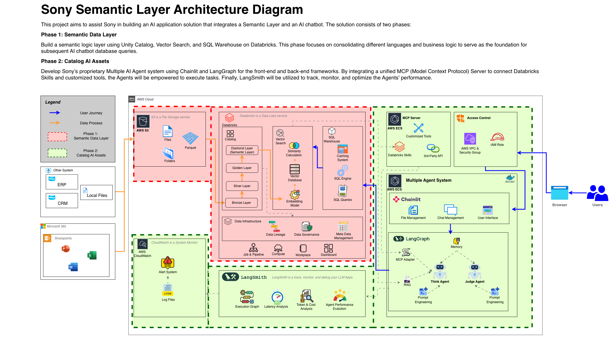

# Databricks Semantic Layer Demo

A end-to-end data pipeline and semantic layer demo built on Databricks, designed to serve as the data foundation for a Multi-Agent AI system.



---

## Project Overview

This project demonstrates how to build a production-style **Lakehouse architecture** on Databricks using **Delta Live Tables (DLT)**, **Unity Catalog**, and a **Semantic Layer** — all connected to a downstream AI Agent system via MCP (Model Context Protocol).

The architecture is divided into two phases:

**Phase 1 — Semantic Data Layer**
Ingest raw data, apply data quality rules and transformations across Bronze → Silver → Gold → Diamond layers, and expose clean semantic tables for querying.

**Phase 2 — Catalog AI Assets** *(planned)*
A Multi-Agent system built with Chainlit and LangGraph that queries the semantic layer through MCP tools, enabling natural language interactions with the data.

---

## Pipeline Architecture

```
Raw CSV Files
     │
     ▼
┌─────────────┐
│   BRONZE    │  External tables registered in Unity Catalog
│ raw_customer│  (ingested via Databricks UI)
│ raw_orders  │
└──────┬──────┘
       │
       ▼
┌─────────────────────────────────────────┐
│               SILVER                    │
│  dim_customers  — dedup + standardize   │
│  fct_orders     — DQ filter + date fmt  │
│  fct_orders_extended — stream-static    │
│                       join              │
└──────┬──────────────────────────────────┘
       │
       ▼
┌─────────────────────────────────────────┐
│                GOLD                     │
│  agg_customer_monthly_stats             │
│  (monthly aggregation by customer)      │
└──────┬──────────────────────────────────┘
       │
       ▼
┌─────────────────────────────────────────┐
│              DIAMOND                    │
│  sem_customer_transaction_summary       │
│  sem_regional_monthly_aov               │
└─────────────────────────────────────────┘
```

---

## Repository Structure

| File | Description |
|------|-------------|
| `sql_dlt.sql` | Full DLT pipeline in SQL (Silver → Gold → Diamond) |
| `pyspark_dlt.py` | Full DLT pipeline in PySpark (Silver → Gold → Diamond) |
| `semantic_model.yml` | Unity Catalog semantic layer definition for AI/BI Genie |
| `databricks_query.py` | Python query functions for MCP server integration |
| `drop_table.sql.dbquery.ipynb` | Utility notebook to reset Silver/Gold/Diamond tables |
| `raw_customer_profile.csv` | Sample customer data (48 records, intentionally dirty) |
| `raw_order_transactions.csv` | Sample order data (1,000 records, mixed formats) |

---

## Key DLT Concepts Demonstrated

- **LIVE TABLE vs STREAMING TABLE** — dimension tables use full-refresh materialized views; fact tables use incremental streaming
- **Stream-Static Join** — `fct_orders_extended` joins a streaming fact table with a static dimension table
- **DLT Expectations** — `CONSTRAINT valid_amount EXPECT (amount > 0) ON VIOLATION DROP ROW`
- **External table references** — Bronze tables live outside the pipeline (`demo.bronze.*`)
- **Internal table references** — Silver/Gold/Diamond tables use the `live.` prefix

---

## Diamond Layer (Semantic Tables)

Two semantic tables in `demo.diamond` expose clean, business-ready surfaces for downstream consumption:

**`sem_customer_transaction_summary`**
Per-customer monthly transaction count and revenue. Supports filtering by `customer_id`, `customer_name`, or `order_month`.

**`sem_regional_monthly_aov`**
AOV (Average Order Value) aggregated by country and month. Supports filtering by `country` or `order_month`.

---

## Query Functions (MCP Integration)

`databricks_query.py` provides two functions designed to be registered as MCP tools:

```python
# Query 1: Customer transaction summary
get_customer_transaction_summary(
    customer_ids=["C001", "C005"],   # optional
    customer_names=["John Doe"],      # optional
    months=["2025-01", "2025-02"]    # optional — omit for all-time total
)

# Query 2: Regional AOV
get_regional_monthly_aov(
    countries=["Taiwan", "Japan"],    # optional
    months=["2025-03"]               # optional
)
```

Both functions return a `pandas.DataFrame`. Connection is configured via environment variables:

```bash
export DATABRICKS_HOST="adb-xxxxxxxxxxxx.xx.azuredatabricks.net"
export DATABRICKS_HTTP_PATH="/sql/1.0/warehouses/xxxxxxxxxxxxxxxx"
export DATABRICKS_TOKEN="your_personal_access_token"
```

---

## Semantic Layer (Unity Catalog YAML)

`semantic_model.yml` defines business-friendly metric and dimension descriptions over the Diamond layer, compatible with **Databricks AI/BI Genie** for natural language querying.

---

## Setup

1. Upload `raw_customer_profile.csv` and `raw_order_transactions.csv` to DBFS or a cloud storage path
2. Register them as external tables under `demo.bronze` via the Databricks UI
3. Create a DLT pipeline in Databricks pointing to `sql_dlt.sql` or `pyspark_dlt.py`
4. Run the pipeline — Silver, Gold, and Diamond tables will be created automatically
5. To reset, run `drop_table.sql.dbquery.ipynb` and re-trigger the pipeline
